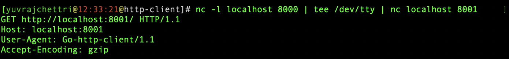
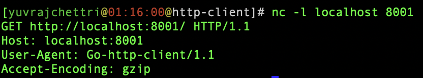

# README

Playing around with some http-client and transport options in Go.

## Proxy

Let's try to show a quick use for the proxy option in _Transport_.

- Start a server A: _nc -l localhost 8001_
- Start server B that forwards it's request to A, while also printing it: _nc -l localhost 8000 | tee /dev/tty | nc localhost 8001_
- Note: Servers must be started in this order as the second command expects server _8001_ to be running beforehand
- Run the _proxy()_ func in our main.go - Create an http client in Go. Modify the _Proxy_ option in it's Transport and provide _localhost:8000_ as the proxy
- Send a _GET_ request to _localhost:8001_, you will find the output in the _proxy terminal_ reflects the requests actual address:

- The output in the _target terminal_ also reflects the same after being routed by the proxy

## Redirect

How to have fine-grained control over redirects? E.g. by default the client will follow ~ 10 redirects, what if we want to follow only one?

- Start a server with _echo -ne "HTTP/1.1 302 Found\r\nLocation: http://localhost:8001\r\n\r\n" | nc -l localhost 8000_
- Note that this doesn't work with _echo_ on the other side of the pipe as the response is echo-ed immediatelly, maybe might work using _tee_ that way
- Run the _redirect()_ func in our main.go - create a client and provide it with a func for its _CheckRedirect_ field.
- Send a _GET_ req to port 8000 on localhost, which will return a redirect. The _via_ slice in the _redirect()_ func will have all the redirects so far, the last one being the newest - the redirect location will be passed as a header in the request, which we print out.
- It is easy to imagine us stopping the redirect by checking the length of _via_ and returning an error.

## Timeout

We can add a timeout to our requests using the _Timeout_ field when creating a new client - something like _http.Client{Timeout: 5 * time.second}_

## Logging

- Logging can be achieved by adding a custom _RoundTripper_ as the _Transport_ field when creating and _http.Client_

- Use _http.DefaultTransport.RoundTrip(req)_ to continue the request.

## Connection Pooling

- To keep connections open for a certain time, use _IdleConnTimeout_ and _MaxIdleConns_ fields inside the _http.Transport_ when creating a new _http.Client_